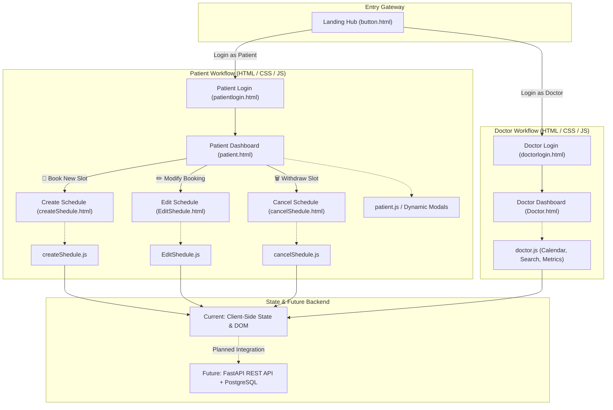
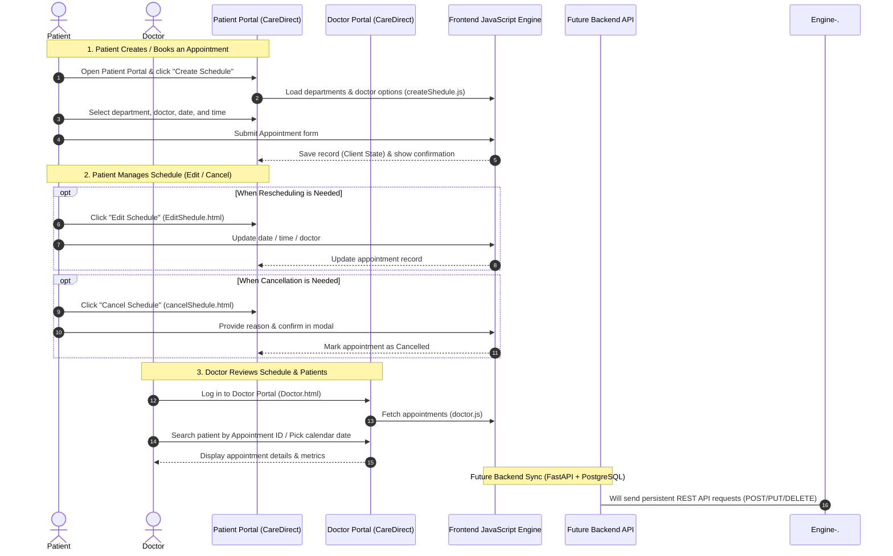
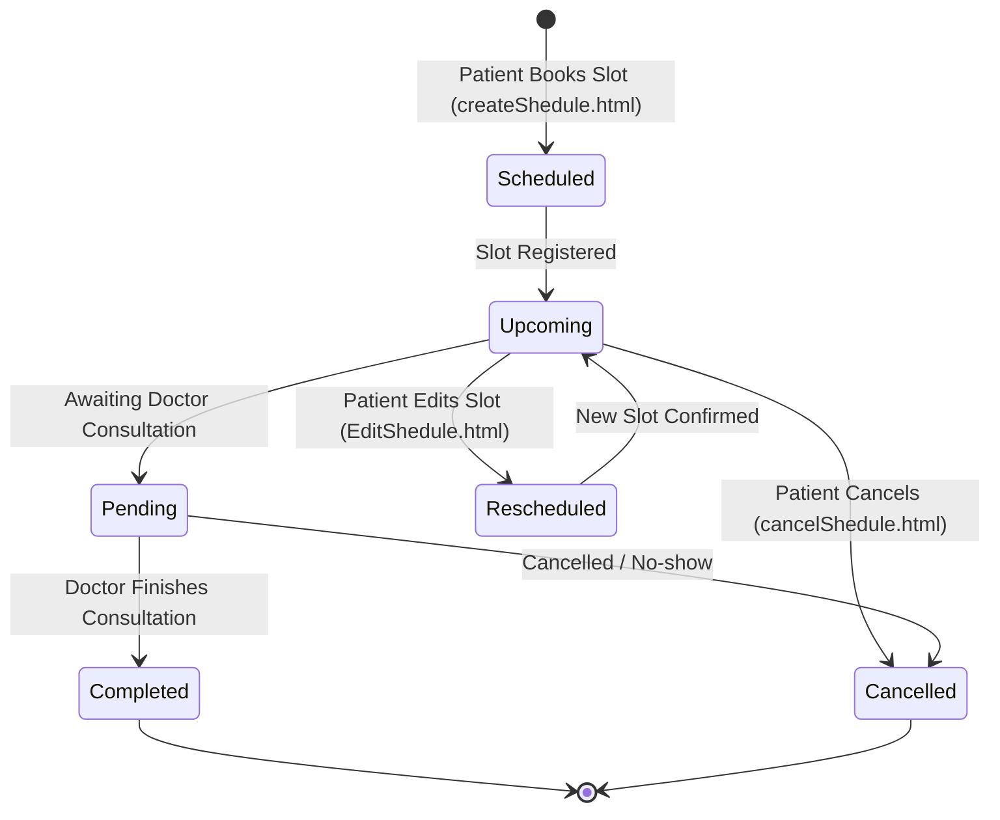

# 🏥 CareDirect — Hospital Appointment & Schedule Management System

> A modern, responsive web application for managing hospital appointment bookings, patient schedules, and doctor consultations. Currently built as a **pure frontend system using HTML5, CSS3, and Vanilla JavaScript**, with a full-stack backend planned for future development.

<p align="center">
  
</p>

---

## 📑 Table of Contents

- [Overview](#-overview)
- [Current Implementation & Tech Stack](#-current-implementation--tech-stack)
- [Key Features](#-key-features)
- [Visual Interface & Screenshots](#-visual-interface--screenshots)
  - [1. Landing & Authentication](#1-landing--authentication)
  - [2. Patient Portal & Scheduling Operations](#2-patient-portal--scheduling-operations)
  - [3. Doctor Portal & Monitoring Dashboard](#3-doctor-portal--monitoring-dashboard)
- [System Architecture](#-system-architecture)
- [Application Flow & Diagrams](#-application-flow--diagrams)
  - [High-Level System Architecture](#high-level-system-architecture)
  - [Patient & Doctor Workflow](#patient--doctor-workflow)
  - [Appointment State Lifecycle](#appointment-state-lifecycle)
- [Project Directory Structure](#-project-directory-structure)
- [Module Breakdown](#-module-breakdown)
  - [1. Portal Gateway & Authentication](#1-portal-gateway--authentication)
  - [2. Patient Scheduling Module](#2-patient-scheduling-module)
  - [3. Doctor Monitoring Module](#3-doctor-monitoring-module)
- [Design System & Styling](#-design-system--styling)
- [Getting Started](#-getting-started)
- [Future Backend Roadmap](#-future-backend-roadmap)
- [Author & Credits](#-author--credits)

---

## 🌟 Overview

The **CareDirect Appointment & Schedule Management Platform** simplifies healthcare scheduling for hospital patients and doctors. Designed with a modular architecture, the system provides separate experiences tailored for patients and medical staff:

- **Patients** have complete control to **book new appointments**, **reschedule (edit) their slots**, and **cancel bookings** across multiple clinical departments (Cardiology, Neurology, Orthopedics, General Medicine, Dermatology, and Pediatrics).
- **Doctors** access a centralized dashboard to **monitor today's schedule**, **search patients by Appointment ID**, view consultation metrics, and inspect the appointment calendar.

---

## 💻 Current Implementation & Tech Stack

> [!NOTE]
> **Current Status**: This project is currently developed purely using **Frontend Web Technologies (HTML5, CSS3, Vanilla JavaScript)**. All interactions, dynamic department-to-doctor mappings, modal controls, and state management run directly on the client side in the browser. A persistent backend (FastAPI / PostgreSQL) is planned for future phases.

```
┌────────────────────────────────────────────────────────────────────────┐
│                        CURRENT TECH STACK                              │
├───────────────────┬───────────────────┬────────────────────────────────┤
│      HTML5        │       CSS3        │     JavaScript (ES6+)          │
│  Semantic Markup  │  Design Tokens    │  DOM Manipulation & Events     │
│  Modular Pages    │  Flexbox & Grid   │  Dynamic Field Mapping         │
│  Accessible Forms │  Responsive Media │  Modal Dialogs & Toast Alerts  │
└───────────────────┴───────────────────┴────────────────────────────────┘
```

---

## ✨ Key Features

- 👤 **Patient Portal & Self-Service Scheduling**:
  - **Create Schedule**: Patients select department, doctor, date, time slot, and reason for visit.
  - **Edit Schedule**: Patients update or reschedule their existing appointment slots.
  - **Cancel Schedule**: Patients cancel appointments with mandatory reason logging and modal confirmation.
  - **History Log**: Patients review their previous and upcoming consultation statuses.
- 🩺 **Doctor Monitoring Dashboard**:
  - **Daily Counters**: Summary metrics for Total Patients, Today's Appointments, Pending, Cancelled, Completed, and Upcoming.
  - **Patient Search**: Fast search lookup by Appointment ID (e.g., `APT-1025`).
  - **Schedule Calendar**: Date-picker and calendar grid to review department appointments.
- 🔐 **Dual Portal Gateway**:
  - Centralized landing hub with separate access gates for Doctors and Patients.
  - Clean login forms featuring toggleable password visibility and validation.
- 📱 **Responsive UI**:
  - Mobile drawer navigation, backdrop modals, and consistent healthcare design system.

---

## 📸 Visual Interface & Screenshots

### 1. Landing & Authentication

The central gateway welcomes users and routes them to either the Doctor Portal or the Patient Portal.

| Central Gateway | Doctor Login | Patient Login |
|:---:|:---:|:---:|
|  |  |  |

---

### 2. Patient Portal & Scheduling Operations

From the **Patient Dashboard**, patients can view their appointments and access all scheduling operations: **Create Schedule**, **Edit Schedule**, and **Cancel Schedule**.

#### 👤 Patient Dashboard
> The patient's home screen featuring quick navigation buttons for creating, editing, and cancelling schedules, alongside the appointment history log.

<p align="center">
  
</p>

#### 📅 Create Schedule (Patient Booking)
> Allows patients to select a medical department, which dynamically populates available specialist doctors and time slots.

<p align="center">
  
</p>

#### ✏️ Edit Schedule (Patient Rescheduling)
> Enables patients to modify existing appointment dates, times, doctors, or reasons for their visit.

<p align="center">
  
</p>

#### ❌ Cancel Schedule (Patient Cancellation)
> A safe cancellation interface where patients choose their booking, provide a cancellation reason, and confirm through a safety modal.

<p align="center">
  
</p>

---

### 3. Doctor Portal & Monitoring Dashboard

#### 🩺 Doctor Schedule Dashboard
> Dedicated panel for healthcare providers to track today's appointments, monitor patient metrics, search specific appointment IDs, and review daily consultation history.

<p align="center">
  
</p>

---

## 🏗️ System Architecture

The current architecture is **100% frontend client-side**, designed with clean modularity so that API endpoints and database storage can be attached seamlessly in the next phase.

```
┌─────────────────────────────────────────────────────────────────────────────────┐
│                    CareDirect — Presentation Layer (HTML5/CSS3)                 │
├───────────────────────────────────────┬─────────────────────────────────────────┤
│            PATIENT PORTAL             │              DOCTOR PORTAL              │
│  • patient.html   (Dashboard)         │  • Doctor.html  (Schedule Dashboard)    │
│  • createShedule.html (Create)        │  • doctorlogin.html (Doctor Login)      │
│  • EditShedule.html   (Edit)          │                                         │
│  • cancelShedule.html (Cancel)        │                                         │
│  • patientlogin.html  (Patient Login) │                                         │
├───────────────────────────────────────┴─────────────────────────────────────────┤
│                     Client Logic Layer (Vanilla JavaScript ES6+)                │
│  • patient.js         • createShedule.js   • EditShedule.js   • cancelShedule.js│
│  • doctor.js          • main.js (Shared Modals, Toast Alerts, Drawer)          │
├─────────────────────────────────────────────────────────────────────────────────┤
│               CURRENT STATE: Browser In-Memory / Client Storage                 │
└───────────────────────────────────────┬─────────────────────────────────────────┘
                                        │
                         (PLANNED FUTURE IMPLEMENTATION)
                                        ▼
┌─────────────────────────────────────────────────────────────────────────────────┐
│                 Backend API (FastAPI)  +  Database (PostgreSQL)                 │
└─────────────────────────────────────────────────────────────────────────────────┘
```

---

## 📊 Application Flow & Diagrams

### High-Level System Architecture

This diagram illustrates how users access the system, highlighting that **Create Schedule, Edit Schedule, and Cancel Schedule belong to the Patient Portal**:



---

### Patient & Doctor Workflow

This sequence diagram illustrates how a patient creates and manages appointments, and how the doctor reviews the schedule:



---

### Appointment State Lifecycle



---

## 📁 Project Directory Structure

```plaintext
health-rel-project/
│
├── assets/
│   ├── css/
│   │   └── style.css            # Central CSS stylesheet (Healthcare theme, variables, grid layouts)
│   │
│   ├── images/                  # High-resolution screenshots of all UI portals & flows
│   │   ├── portal-landing.png   # Central landing gateway preview
│   │   ├── doctor-login.png     # Doctor authentication view
│   │   ├── patient-login.png    # Patient authentication view
│   │   ├── patient-portal.png   # Patient dashboard with CRUD action links
│   │   ├── create-schedule.png  # Patient: Create schedule / booking form
│   │   ├── edit-schedule.png    # Patient: Edit schedule / rescheduling form
│   │   ├── cancel-schedule.png  # Patient: Cancel schedule & confirmation interface
│   │   └── doctor-dashboard.png # Doctor: Management & monitoring dashboard
│   │
│   └── js/
│       ├── main.js              # Shared UI utilities (Mobile drawer, modal controller, toast engine)
│       ├── patient.js           # Patient dashboard logic and booking modal controller
│       ├── createShedule.js     # Patient: Dynamic department-to-doctor dropdown & form handler
│       ├── EditShedule.js       # Patient: Rescheduling form prefill & modification handler
│       ├── cancelShedule.js     # Patient: Cancellation modal & reason validation
│       └── doctor.js            # Doctor: Dashboard metrics, calendar date selection & search
│
├── pages/
│   ├── button.html              # Central launchpad / portal selection (Doctor vs. Patient)
│   ├── doctorlogin.html         # Login page for healthcare providers
│   ├── patientlogin.html        # Login page for patients
│   ├── patient.html             # Main Patient Dashboard (hub for create, edit, and cancel schedule)
│   ├── createShedule.html       # Patient page: Create new appointment schedule
│   ├── EditShedule.html         # Patient page: Modify / reschedule appointment
│   ├── cancelShedule.html       # Patient page: Cancel appointment
│   └── Doctor.html              # Main Doctor Dashboard: calendar, patient search & metrics
│
├── .gitignore                   # Ignores OS artifacts and nested repository clones
├── LICENSE                      # MIT License
└── README.md                    # Project documentation & architectural guide
```

---

## 🧩 Module Breakdown

### 1. Portal Gateway & Authentication
- **`pages/button.html`**: Entry landing page with choice of Doctor or Patient access.
- **`pages/doctorlogin.html`**: Login card for medical practitioners.
- **`pages/patientlogin.html`**: Login card for hospital patients.

### 2. Patient Scheduling Module
All appointment creation, editing, and cancellation actions belong to the **Patient Portal**:
- **`pages/patient.html` (`patient.js`)**: Main patient hub featuring action buttons (`Create Schedule`, `Edit Schedule`, `Cancel Schedule`) and consultation history.
- **`pages/createShedule.html` (`createShedule.js`)**: Patient booking form that dynamically loads specialist doctors based on the selected department.
- **`pages/EditShedule.html` (`EditShedule.js`)**: Patient rescheduling form for updating dates, time slots, or medical reasons.
- **`pages/cancelShedule.html` (`cancelShedule.js`)**: Patient cancellation workflow with confirmation modal and reason logging.

### 3. Doctor Monitoring Module
- **`pages/Doctor.html` (`doctor.js`)**:
  - Live metric summary cards (Total Patients, Today's Appointments, Pending, Cancelled, Completed, Upcoming).
  - Search patient records by **Appointment ID**.
  - Interactive calendar for reviewing appointments scheduled on specific dates.
  - Complete schedule history log.

---

## 🎨 Design System & Styling

Clean, modern healthcare UI styling using native CSS custom properties:

| Variable | Hex Value | Purpose |
| --- | --- | --- |
| `--primary-color` | `#2563eb` (Blue 600) | Main brand tone, primary buttons, active tabs |
| `--primary-dark` | `#1d4ed8` (Blue 700) | Button hover states and focused controls |
| `--primary-light` | `#eff6ff` (Blue 50) | Card highlights and row selection tints |
| `--success-color` | `#166534` (Green 800) | Completed appointments and confirmation toasts |
| `--warning-color` | `#92400e` (Amber 800) | Pending appointment badges |
| `--danger-color` | `#991b1b` (Red 800) | Cancelled status badges and cancellation warnings |
| `--background-color`| `#f8fafc` (Slate 50) | Main application canvas |
| `--surface-color` | `#ffffff` (Pure White) | Card containers, modal sheets, and tables |

---

## 🚀 Getting Started

### Prerequisites
- Any modern web browser (Chrome, Edge, Firefox, Safari). No build tools, package managers, or server runtimes are required.

### How to Run Locally
1. Clone the repository:
   ```bash
   git clone https://github.com/ankitakumari-eng/Appointment_shedule.git
   ```
2. Open [`pages/button.html`](file:///C:/Users/Hp/Desktop/health-rel-project/pages/button.html) in your browser:
   - Double-click the file in File Explorer, or
   - Right-click in VS Code and choose **"Open with Live Server"**.
3. Click **"Login for Patients"** to explore creating, editing, and cancelling schedules, or **"Login for Doctors"** to explore the monitoring dashboard.

---

## 🔮 Future Backend Roadmap

The current frontend is architected to seamlessly integrate with a full backend stack in upcoming releases:

- [ ] **FastAPI REST API**: Endpoints for appointment CRUD (`POST /appointments`, `PUT /appointments/{id}`, `DELETE /appointments/{id}`, `GET /appointments`).
- [ ] **PostgreSQL Database**: Relational schema for patients, doctors, departments, and appointment records.
- [ ] **Authentication & Roles**: JWT-based login with doctor and patient authorization scopes.
- [ ] **Automated Conflict Detection**: Server-side validation to prevent overlapping bookings.
- [ ] **SMS & Email Notifications**: Automated reminders for upcoming and rescheduled appointments.

---

## 👩‍💻 Author & Credits

- **Developer**: [Ankita Kumari](https://github.com/ankitakumari-eng)
- **Module**: Scheduling Management (*Appointment Creation, Rescheduling, Cancellation & Doctor Roster*)
- **License**: Released under the [MIT License](LICENSE).
