# 🏥 CareDirect — Hospital Appointment & Schedule Management System

> A modern, responsive, and modular web application for managing hospital appointment bookings, doctor schedules, department rosters, and patient-doctor consultations.

<p align="center">
  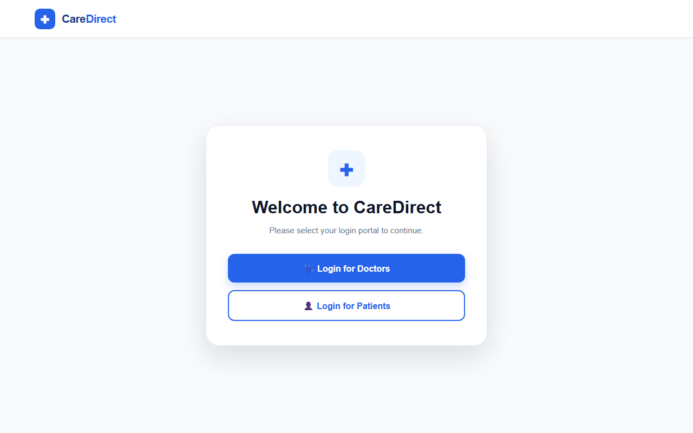
</p>

---

## 📑 Table of Contents

- [Overview](#-overview)
- [Key Features](#-key-features)
- [Visual Interface & Screenshots](#-visual-interface--screenshots)
  - [1. Landing & Authentication](#1-landing--authentication)
  - [2. Doctor & Patient Dashboards](#2-doctor--patient-dashboards)
  - [3. Schedule Management Operations](#3-schedule-management-operations)
- [System Architecture](#-system-architecture)
- [Application Flow & Diagrams](#-application-flow--diagrams)
  - [High-Level Architecture](#high-level-architecture)
  - [Appointment Workflow](#appointment-workflow)
  - [Appointment State Lifecycle](#appointment-state-lifecycle)
- [Project Directory Structure](#-project-directory-structure)
- [Module Breakdown](#-module-breakdown)
  - [Portals & Authentication](#portals--authentication)
  - [Doctor Management Portal](#doctor-management-portal)
  - [Patient Booking Portal](#patient-booking-portal)
  - [Schedule Operations (CRUD)](#schedule-operations-crud)
- [Design System & Styling](#-design-system--styling)
- [Getting Started](#-getting-started)
- [Future Enhancements](#-future-enhancements)
- [Author & Credits](#-author--credits)

---

## 🌟 Overview

The **CareDirect Appointment & Schedule Management Platform** simplifies healthcare scheduling for hospitals, clinics, and medical practices. Built with a clean frontend architecture, it provides doctors and patients with tailored portals to streamline appointment creation, updates, cancellations, and status tracking.

The platform is designed to eliminate appointment scheduling conflicts, improve patient access to specialists across diverse departments (Cardiology, Neurology, Orthopedics, Pediatrics, Dermatology, and General Medicine), and provide clear operational visibility.

---

## ✨ Key Features

- 🩺 **Doctor Dashboard**:
  - Live statistics summary cards (Total Appointments, Completed, Upcoming, Pending, and Cancelled).
  - Search and filter appointments by date, patient name, and department.
  - Quick action controls to view details, reschedule, or cancel consultations.
- 👤 **Patient Portal**:
  - Intuitive booking interface for choosing medical departments and selecting qualified specialists.
  - Real-time display of booking status and appointment timestamps.
- 📅 **Schedule Management (CRUD)**:
  - **Create Schedule**: Dynamic department-to-doctor dropdown mapping and slot generation.
  - **Edit Schedule**: Flexible updates for consultation timings and doctor reassignments.
  - **Cancel Schedule**: Safe cancellation workflow with reason input and confirmation modals.
- 🔐 **Dual Portal Gateway**:
  - Centralized landing page with separate access points for doctors and patients.
  - Dedicated authentication views with input validation and toggleable secure views.
- 📱 **Modern & Responsive UI**:
  - Built using CSS custom properties (design tokens), flexible CSS Grid, and Flexbox.
  - Interactive toast notifications, backdrop-closing modals, and responsive mobile navigation drawers.

---

## 📸 Visual Interface & Screenshots

### 1. Landing & Authentication

The centralized gateway allows healthcare providers and patients to select their respective workspaces. Each portal features secure authentication forms designed for simplicity.

| Central Gateway | Doctor Login | Patient Login |
|:---:|:---:|:---:|
|  | 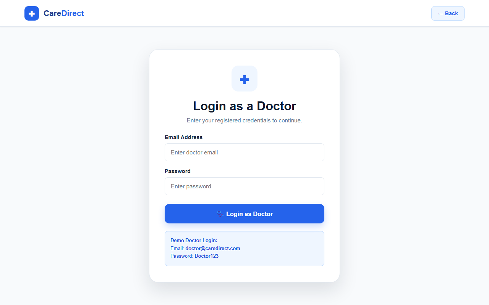 | 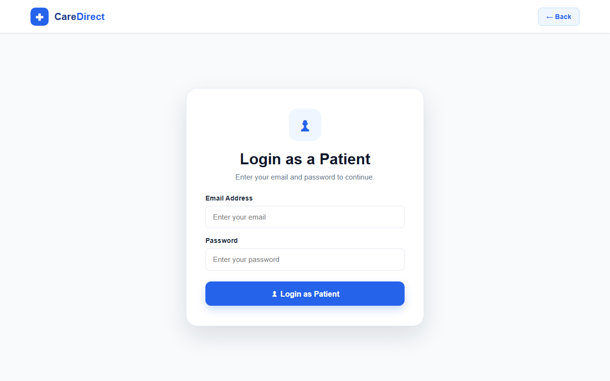 |

---

### 2. Doctor & Patient Dashboards

Dedicated dashboards provide tailored views: doctors monitor daily metrics and patient appointments, while patients can book slots and view their consultation status.

#### 🩺 Doctor Dashboard
> Monitor patient queues, upcoming consultations, and appointment statistics across all medical departments.

<p align="center">
  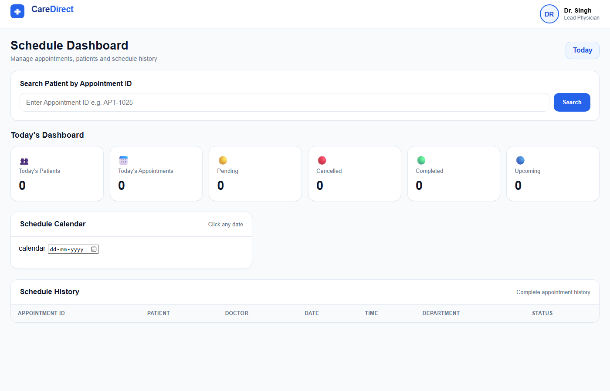
</p>

#### 👤 Patient Portal
> Seamless interface for patients to view appointment history, check statuses, and book new consultations.

<p align="center">
  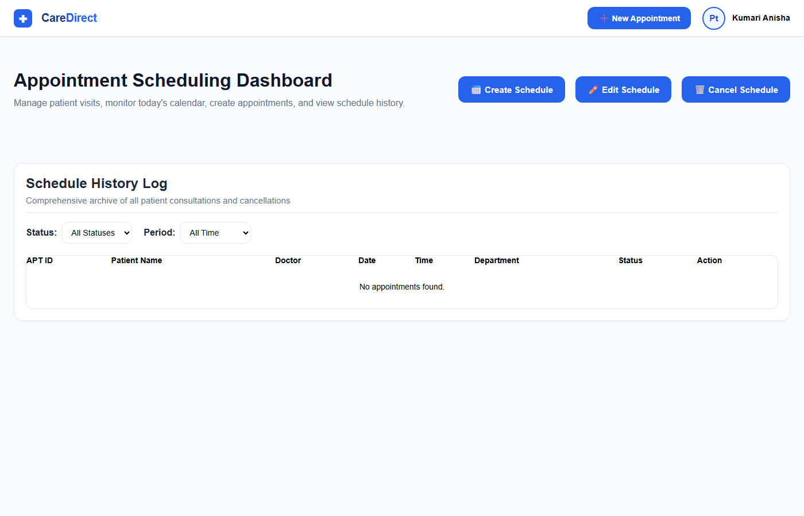
</p>

---

### 3. Schedule Management Operations

Streamlined screens for creating, modifying, and canceling medical appointments.

#### 📅 Create Schedule
> Dynamically loads doctors according to the selected clinical department (Cardiology, Neurology, Orthopedics, etc.).

<p align="center">
  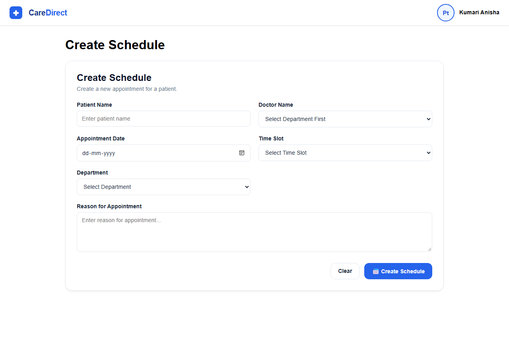
</p>

#### ✏️ Edit Schedule
> Pre-fills existing appointment information, allowing quick rescheduling and patient detail updates.

<p align="center">
  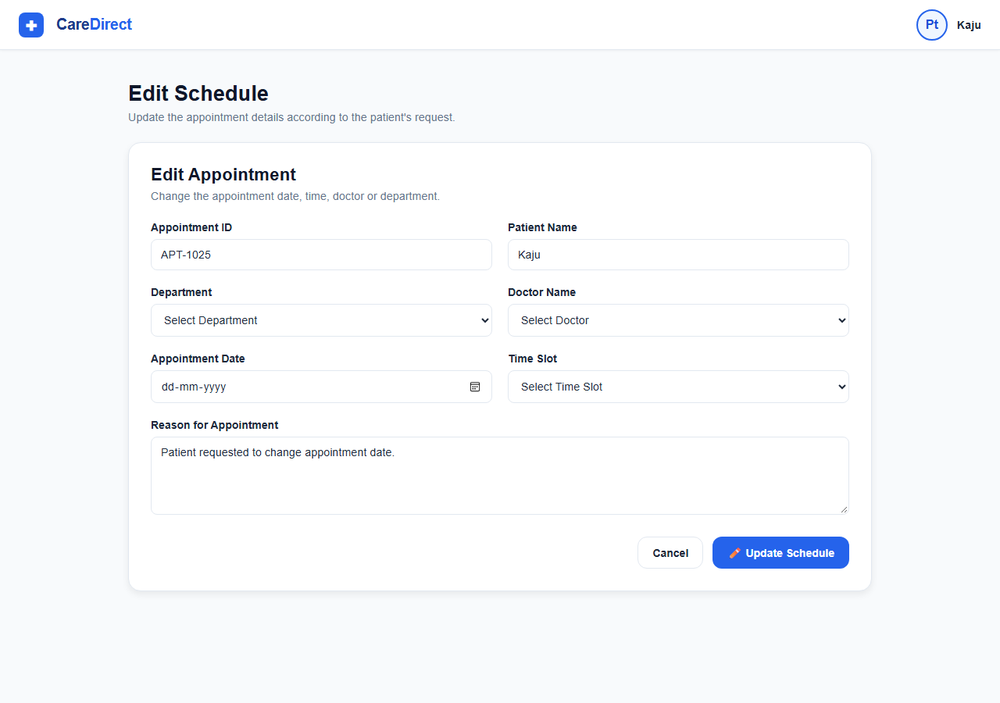
</p>

#### ❌ Cancel Schedule
> Provides a safe cancellation procedure requiring reason submission and confirmation to prevent accidental slot deletion.

<p align="center">
  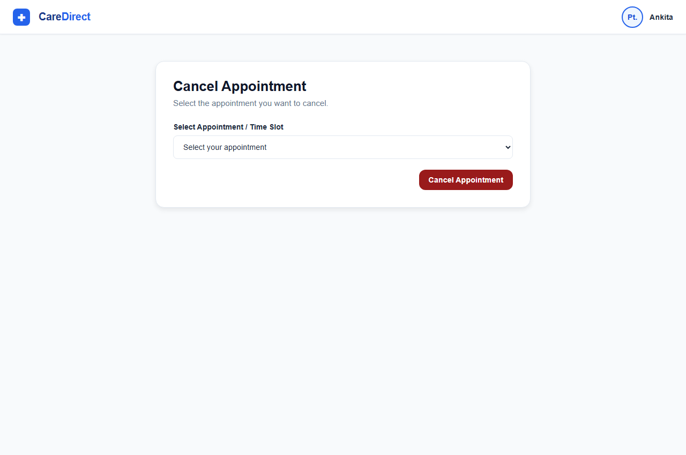
</p>

---

## 🏗️ System Architecture

The project follows a clean separation of concerns between structure (**HTML5**), presentation (**CSS3 Modern Design System**), and behavior (**ES6+ JavaScript**). It is architected for straightforward integration into a backend API (such as FastAPI or Express.js) and a database (such as PostgreSQL).

```
┌─────────────────────────────────────────────────────────────────┐
│                      CareDirect Client                          │
├────────────────────────────────┬────────────────────────────────┤
│          Doctor Portal         │         Patient Portal         │
│   (Doctor.html, doctor.js)     │   (patient.html, patient.js)   │
├────────────────────────────────┴────────────────────────────────┤
│                    Schedule Management Engine                   │
│   • createShedule.js   • EditShedule.js   • cancelShedule.js    │
├─────────────────────────────────────────────────────────────────┤
│                    Shared UI & Design System                    │
│   • style.css          • main.js (Modals, Toasts, Drawer)       │
└────────────────────────────────┬────────────────────────────────┘
                                 │
                   (Future REST API Integration)
                                 ▼
┌─────────────────────────────────────────────────────────────────┐
│             FastAPI Backend  +  PostgreSQL Database             │
└─────────────────────────────────────────────────────────────────┘
```

---

## 📊 Application Flow & Diagrams

### High-Level Architecture

The flowchart below illustrates how users enter the system through the landing portal, authenticate, and interact with the modular scheduling engine:

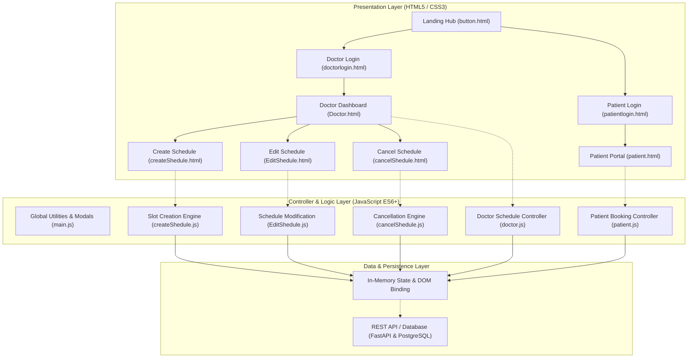

---

### Appointment Workflow

The sequence diagram below outlines the full lifecycle of a consultation request between the patient, the doctor, and the scheduling handler:

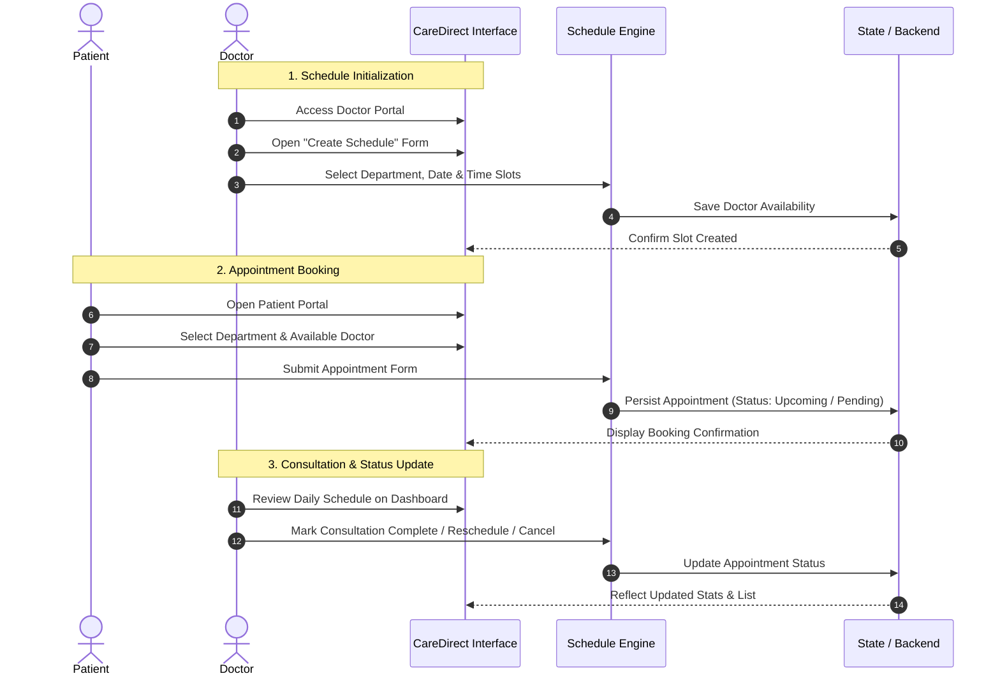

---

### Appointment State Lifecycle

The state diagram below depicts the valid state transitions for an appointment within the system:

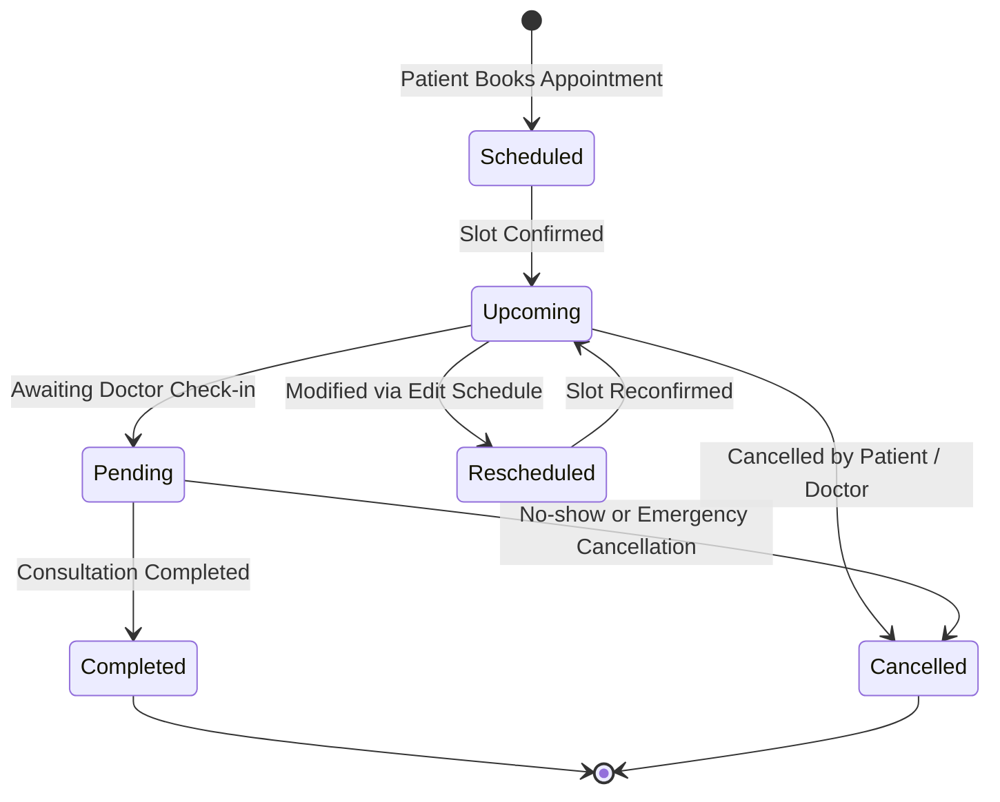

---

## 📁 Project Directory Structure

```plaintext
health-rel-project/
│
├── assets/
│   ├── css/
│   │   └── style.css            # Central CSS stylesheet (Theme variables, typography, responsive grids)
│   │
│   ├── images/                  # High-resolution screenshots of portals and workflows
│   │   ├── portal-landing.png   # Central landing gateway preview
│   │   ├── doctor-login.png     # Doctor authentication view
│   │   ├── patient-login.png    # Patient authentication view
│   │   ├── doctor-dashboard.png # Doctor appointment management dashboard
│   │   ├── patient-portal.png   # Patient booking and history interface
│   │   ├── create-schedule.png  # Create schedule / booking form
│   │   ├── edit-schedule.png    # Edit schedule / reschedule form
│   │   └── cancel-schedule.png  # Appointment cancellation interface
│   │
│   └── js/
│       ├── main.js              # Core UI helpers (Mobile drawer, modal controller, toast engine)
│       ├── doctor.js            # Doctor dashboard controller (Statistics, data filters, tables)
│       ├── patient.js           # Patient booking workflow and appointment list rendering
│       ├── createShedule.js     # Department-to-doctor dynamic mapping and schedule creation
│       ├── EditShedule.js       # Form management for rescheduling existing appointments
│       └── cancelShedule.js     # Cancellation verification, modal handling, and state removal
│
├── pages/
│   ├── button.html              # Central launchpad / portal selection (Doctor vs. Patient)
│   ├── doctorlogin.html         # Secure login view for healthcare providers
│   ├── patientlogin.html        # Secure login view for patients
│   ├── Doctor.html              # Main Doctor management dashboard & appointment roster
│   ├── patient.html             # Patient dashboard with self-service appointment booking
│   ├── createShedule.html       # Standalone interface for publishing new doctor schedule slots
│   ├── EditShedule.html         # Standalone interface for modifying existing consultation schedules
│   └── cancelShedule.html       # Standalone interface for processing appointment cancellations
│
├── .gitignore                   # Excludes dependencies, OS artifacts, and nested repositories
├── LICENSE                      # Project License (MIT)
└── README.md                    # Project documentation & architectural guide
```

---

## 🧩 Module Breakdown

### Portals & Authentication
- **`pages/button.html`**: The unified entry point. Provides access to either the Doctor Portal or Patient Portal with medical-themed navigation cards.
- **`pages/doctorlogin.html` & `pages/patientlogin.html`**: Clean login cards featuring password visibility toggles, credential validation, and direct redirects to respective dashboards.

### Doctor Management Portal
- **`pages/Doctor.html` & `assets/js/doctor.js`**:
  - Live metric widgets displaying counts of Total, Upcoming, Pending, Completed, and Cancelled appointments.
  - Filter by date picker or department filter to instantly view matching schedules.
  - Interactive table actions: View patient details, edit time slots, or cancel visits.

### Patient Booking Portal
- **`pages/patient.html` & `assets/js/patient.js`**:
  - Self-service booking modal allowing patients to choose appointment date, department, and doctor.
  - Displays upcoming appointments with status indicators and quick cancellation options.

### Schedule Operations (CRUD)
- **`createShedule.html` & `createShedule.js`**:
  - Dynamic doctor population based on selected department:
    - *Cardiology, Neurology, Orthopedics, General Medicine, Dermatology, Pediatrics*.
  - Inputs for consultation start/end times, room number, and consultation limits.
- **`EditShedule.html` & `EditShedule.js`**:
  - Pre-populates selected schedule data for easy time slot and date adjustments.
- **`cancelShedule.html` & `cancelShedule.js`**:
  - Dropdown selection of active bookings.
  - Mandatory cancellation reason collection and multi-step modal confirmation to prevent accidental removals.

---

## 🎨 Design System & Styling

The user interface adheres to standard healthcare digital design practices:

| Variable | Hex Value | Purpose |
| --- | --- | --- |
| `--primary-color` | `#2563eb` (Blue 600) | Primary brand color, primary action buttons, active navigation |
| `--primary-dark` | `#1d4ed8` (Blue 700) | Button hover states and focused controls |
| `--primary-light` | `#eff6ff` (Blue 50) | Light card highlights and active table row tints |
| `--success-color` | `#166534` (Green 800) | Completed appointments and success notifications |
| `--warning-color` | `#92400e` (Amber 800) | Pending appointment badges |
| `--danger-color` | `#991b1b` (Red 800) | Cancelled appointment badges and deletion warnings |
| `--background-color`| `#f8fafc` (Slate 50) | Main background canvas |
| `--surface-color` | `#ffffff` (Pure White) | Dashboard containers, modal windows, and cards |

---

## 🚀 Getting Started

### Prerequisites
- A modern web browser (Google Chrome, Mozilla Firefox, Microsoft Edge, or Safari).
- (Optional) [VS Code](https://code.visualstudio.com/) with the **Live Server** extension for live-reload development.

### Running the Application Locally
1. Clone the repository:
   ```bash
   git clone https://github.com/ankitakumari-eng/Appointment_shedule.git
   ```
2. Navigate to the project directory:
   ```bash
   cd Appointment_shedule
   ```
3. Open the landing portal:
   - Double-click [`pages/button.html`](file:///C:/Users/Hp/Desktop/health-rel-project/pages/button.html) in your file manager, or
   - Right-click `pages/button.html` in VS Code and select **"Open with Live Server"**.
4. Select **"Login for Doctors"** to test the doctor dashboard, or **"Login for Patients"** to test appointment booking.

---

## 🔮 Future Enhancements

- [ ] **Backend Integration**: Connect frontend controllers to a **FastAPI** backend with PostgreSQL storage.
- [ ] **JWT Authentication**: Add secure token-based user authentication and role-based route guards.
- [ ] **Conflict Detection**: Implement automatic slot overlap detection to prevent double bookings.
- [ ] **Email / SMS Reminders**: Integrate notification services for upcoming consultation alerts.
- [ ] **Prescription & Medical Records**: Add document upload and consultation summary downloads.

---

## 👩‍💻 Author & Credits

- **Developer**: [Ankita Kumari](https://github.com/ankitakumari-eng)
- **Module**: Scheduling Management (*Appointments, Doctor Availability & Rosters*)
- **License**: Released under the [MIT License](LICENSE).
